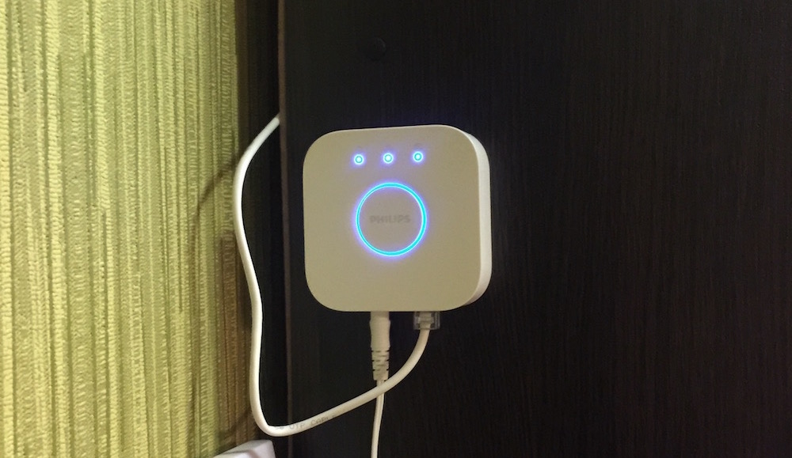
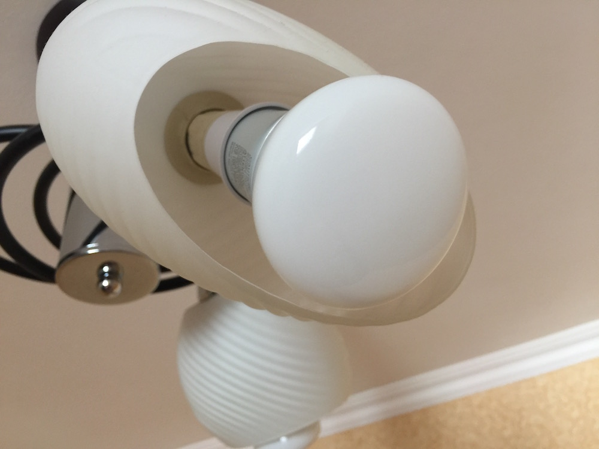

My bedroom was always located on a sunny side of the house and I used to wake up rested even if I had slept only a few hours. This built-in 
natural alarm is doing the job - when the sun is rising you automatically wake up. But, almost a year ago, I moved to new flat, where the bedroom 
located wrong, and no matter how much I'm sleeping - every morning is a hard labor for me.

In search of the solution for this issue, I remembered an idea to buy Phillips Hue bulbs, which have a possibility to simulate sunrise. Of 
course, as usually, firstly I started to surf the web for feedback on this device and they were so different. Yes, it is expensive and, maybe, 
not worth its price, but nevertheless, I decided to test them. So, I found a lot with an acceptable price on olx *(online marketplace in Ukraine)* and bought it.

There are 3 bulbs and a hub inside the box, which doesn't have a built-in wifi, you need to connect it to your router via cable, which is ridiculous 
in 2016 as for me. The good part of it, that the hub is actually very light, so I put it to the wall with 3M scotch tape.

Thankfully, I knew that the bulbs would come with another socket than my luster has, so I ordered adapters beforehand on aliexpress. Weird 
thing - there is an info on the box saying the bulbs are designed for an E26 socket, while they suited E27.

I have used them few days and, I think, my feedback right now is still very subjective. Yes, they're cool, a lot of colors, adjustable brightness 
level etc. **The smart alarm works!** I've started to wake up by the light, not that annoying sound of the alarm. I'm not saying that it that help 
to awake more rested, but it is definitely help. If I have a usual sound alarm for 08:30, I'm setting an additional light alarm on 08:00 which means 
they will light at 07:30 with minimum brightness level and kind of yellow-to-red color and till 08:00 they would light brighter and change color to 
yellow, simulating sunrise.

After bulb's installation, you need to turn their switch to permanent on - so they will be always with energy. And for turning them off you need to use 
your smartphone. There is a new issue with it - because of emergency situations, the lamps don't remember their state after, for example, power outage. 
That means, if in night electricity will be gone for a while, they will turn on and light. Phillips tries to prevent situations, when you really don't 
care about anything, you don't have time to search for your phone, you just need to turn on lights - so you just toggling light switch. This scenario 
looks like the same for the hub as a power outage. To solve it, I ordered Raspberry Pi 3 and will write a little program which will count toggles and 
only if you toggled it more than twice - bulbs will light.

Over the all, I will definitely recommend it to you, if your budget has free dollars to spend on toys. It is a great starting point for creation of your 
Smart House, easy installation, and damage-free to your flat's upkeep, which is nice if you rent it.
