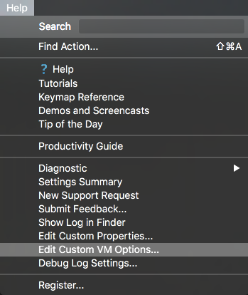

Choosing an editor is not that easy stuff. I've tried various of them and fall in love with PhpStorm. It has all I need and even more - 
IntelliSense, built-in nodejs debugger, FTP client, terminal etc. But it is an IDE - so that means lags can appear from time to time. The
startup time is too long, you need to restart it to free the memory and it seems I can be faster than my editor.

I'm constantly trying to migrate to Atom but it is still too laggy for me too, while Sublime is kind of too old and not that much developing.
While it is still my second editor of choice, I'm primarily working in PhpStorm and searching for the ways how I can speed up it. In my best 
dreams, IntelliJ *(developer of PhpStorm and other products)* finally rewrites it to some native code, because right now it is running on Java - 
which is the main issue why it's so laggy.

Of course, people recommends to disable unusable plugins, decrease level of precise of IntelliSense parser, invalidate caches of the projects, 
disable something else etc. But, hold on, I love it because it has it all. So I've searched more and found one quick fix which helped me a lot.

So, you need to open your **VM options file**. You can do it from Help menu of PhpStorm.



Here how it looks for me. Last two lines are what we need.

```bash
-Xms512m
-Xmx2048m
-XX:MaxPermSize=350m
-XX:ReservedCodeCacheSize=225m
-XX:+UseCompressedOops
-XX:+UseCodeCacheFlushing

-Dawt.useSystemAAFontSettings=lcd
-Dawt.java2d.opengl=true
```

We're telling to a virtual machine to use OpenGL graphics for rendering UI stuff. Weird, but it helps. Also, you can increase memory virtual 
machine can use by changing first two parameters.

This solution isn't a panacea, but better than nothing.
