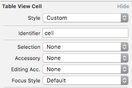
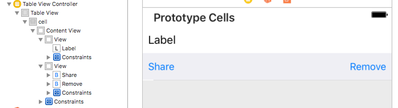

While developing my subproject, I had faced a problem creating a view with buttons, which appears like dropdown when the user taps on 
table view's cell. Seeking the best way how to do it, I googled a lot, read many posts from StackOverflow and all that suggestions were 
really shitty, as for me. So, as usually, I decided to create yet another own bicycle :)

What we want to achieve: 


So, as you can see from GIF above, this is the menu we want to achieve:

* When a user taps on a cell, additional view in `UITableViewCell` containing buttons unfolds with animation under the cell. When a user 
taps it again, or taps on another cell - current cell should fold and new one unfolds.
* When a user has selected the cell and scroll the table - the selected cell should be persisted
and correctly redrew when user will scroll back to it.
* When a user unfolds a cell's dropdown menu and there are not enough space on the screen to fit it - the view should scroll to fit the 
entire cell with an unfolded menu.

Let's try to implement it and create as little as possible bicycles in the code! 

Firstly, create a basic project structure. Create a `Single view application` in Xcode. Open that newly created `Main.storyboard`. By 
default, you will receive *UIViewController* as an initial controller on a storyboard. Replace it with the `UITableViewController` and 
make it an *Initial View Controller*. Give a nice class name for this table view, like *TableViewController*.

Create a cell inside table view, give it a reuse identifier *(e.g. **cell**)* and a custom class *(let's name it TableViewCell)*. Set 
cell's selection to **None**.



Now let's work with a cell for a while. Create 2 views inside a cell, where the first view will fit usual content your cell should have, 
like, in our case - `UILabel`, while another view will act as dropdown and contains some buttons - *Share* and *Remove*. Check 
`Clip To Bounds` for the second view, so when it will fold, buttons inside it will be cutted correctly.



It's time for constraints! For the **first** view, we need to add *left, top and right* constraints with constant 0 to Superview. Also,
set *bottom* constraint with constant 0, which pointed to the second view. As for the **second** view, we need do an exact same thing, 
except exchange top with the bottom. Also, add *height* constraint and set desired constant to it - in my case, it is 40. This constraint 
will be pinned to an outlet and will be toggled for simulating unfolding action.

Add desired constraints for other views. As for buttons inside the **second view**, they should not be pinned to the *top and bottom* of 
the superview, because, when this view will be collapsing, this buttons would follow it and decrease their height also, which looks awful. 
Just add height constraints to them, and *top left* or *top right*.

Finally, it is a time for coding, to make all this alive. We don't need to touch *AppDelegate* at all, so leave it. Let's start from 
**TableViewController.swift**. Create a class, which inherits from `UITableViewController`, and add some initial stuff. For this example 
project, I took a default month labels from `DateFormatter`. Turn on *automatic dimension* for the table view, so cell's height will be 
calculated automatically. Also, add helper function, which will allow you to easily update height of table's cells. Pity, but it is the one 
solution how to do it for currently visible cells.

```swift
class TableViewController: UITableViewController {
    
    var data: [String]!
    
    override func viewDidLoad() {
        data = DateFormatter().standaloneMonthSymbols
        
        tableView.estimatedRowHeight = 40
        tableView.rowHeight = UITableViewAutomaticDimension
    }
    
    func updateTableView() {
        tableView.beginUpdates()
        tableView.endUpdates()
    }
    
}
```

By default, `UITableViewController` conforms delegate and data source protocols of `UITableView`, so let's describe them. I like to code 
them as an extension of the class, and add cells identifies as *enums*, but it is your choice how to format this code 
*(pay attention to comments)*:

```swift
extension TableViewController {
    
    enum cellIdentifiers: String {
        case cell = "cell"
    }
    
    override func tableView(_ tableView: UITableView, numberOfRowsInSection section: Int) -> Int {
        return data.count
    }
    
    override func tableView(_ tableView: UITableView, cellForRowAt indexPath: IndexPath) -> UITableViewCell {
        let cell = tableView.dequeueReusableCell(withIdentifier: cellIdentifiers.cell.rawValue, for: indexPath) as! TableViewCell // custom class for cell, will create it later
        let item = data[indexPath.row]
        
        cell.label.text = item
        
        if tableView.indexPathForSelectedRow?.row == indexPath.row {
            cell.toggleSelected(true)
        }

        // when we are dequeuing a cell which is selected, we need to 'emulate' selection
        // because no other method is called, and this is the best solution I have come to. 
        
        return cell
    }
    
    // Allow user to deselect selected row when tapping on it
    override func tableView(_ tableView: UITableView, willSelectRowAt indexPath: IndexPath) -> IndexPath? {
        if tableView.indexPathForSelectedRow == indexPath {
            tableView.deselectRow(at: indexPath, animated: true)
            updateTableView() // resize the cell, remember it?
            return nil
        }
        
        return indexPath
    }
    
    // Scroll to an unfolded cell, if it doesnt fit on the screen
    override func tableView(_ tableView: UITableView, didSelectRowAt indexPath: IndexPath) {
        updateTableView()
        let cellRect = tableView.rectForRow(at: indexPath)
        if !tableView.bounds.contains(cellRect) {
            tableView.scrollToRow(at: indexPath, at: .none, animated: true)
        }
    }
    
    // Update cell height when deselecting cell
    override func tableView(_ tableView: UITableView, didDeselectRowAt indexPath: IndexPath) {
        updateTableView()
    }
    
}
```

As you saw above, we have called some strange method named `toggleSelected` of the table view's cell. We will implement it later. 

What it does is that magic, which resizes height constraint of the **second** subview of a cell, but without animation. And the animated 
version is located in overrode `setSelected` method. 

Why is it done in this way? This method has 2 arguments - **state**, bool value which indicates the selection's state and **animated**, 
which is also Bool, and tells the cell if it should use animations to update the view or update immediately. By default, when user taps 
on any cell to select it, delegate calls `setSelected` method, providing to it **false** as a value for **animated** parameter, and it 
does not suit me, that's why I can't rely on it.

So, we create 2 separate functions - one, which does the job, and another - calls the first with animation.

Let's take a look at the source code of the cell *(don't forget about comments)*:

```swift
class TableViewCell: UITableViewCell {
    @IBOutlet var label: UILabel!
    @IBOutlet var editViewHeightConstraint: NSLayoutConstraint!
    
    let selectedViewHeight:CGFloat = 0

    // nulify the constraint    
    override func awakeFromNib() {
        super.awakeFromNib()
        
        // save dropdown view's height from storyboard and reset it
        selectedViewHeight = editViewHeightConstraint.constant
        editViewHeightConstraint.constant = 0
    }
    
    // when we are reusing cell, it could be expanded before - so we need to reset constraint's constant
    override func prepareForReuse() {
        editViewHeightConstraint.constant = 0
        super.prepareForReuse()
    }
    
    // The main function, which does the magic - toggles constant of constraint
    func toggleSelected(_ selected: Bool) {
        let constant = selected ? self.selectedViewHeight : 0
        self.editViewHeightConstraint.constant = constant
        self.layoutIfNeeded()
    }
    
    // Calls previous function with animation
    override func setSelected(_ selected: Bool, animated: Bool) {
        UIView.animate(withDuration: 0.3, delay: 0, options: [.allowUserInteraction, .beginFromCurrentState], animations: {
            self.toggleSelected(selected)
        })
        
        super.setSelected(selected, animated: animated)
    }

}
```

The only thing we missing is connect `UILabel` and `NSLayoutConstraint` **outlets** to the elements in a storyboard.

Finally, you can run the application now. Try to select and deselect a cell; select the first one and scroll up and down, so it 
disappears and appears again - pay attention that it is rendered correctly; change screen orientation - everything works as expected.

I think we have achieved goals, which we had set before. Except I don't like that check for selected cell in `cellForRowAt` delegate's 
method - but, again, it is the best solution I came to. Also, it is a shame that after all these years there are no other ways how to 
update height of automatic dimension cell but calling *beginUpdates/endUpdates*.

There is another solution how to achieve dropdown menu in a table view via adding one more cell and controlling its position inside the
table - but I don't like it either because you can't design it as you want to.

Maybe you have a better way how to do it, or some improvements for this one? Share it with me! You can leave a *Pull Request* in a GitHub
repo, where this example project is located. [By the way, here it is.](https://github.com/vitaliyr/swift-tableview-dropdown-menu-example)
