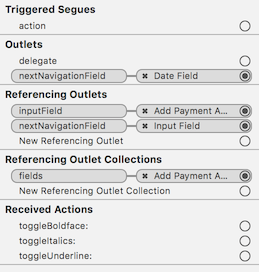
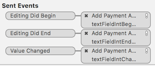
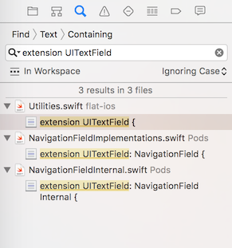
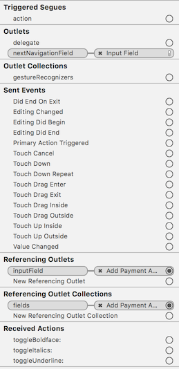
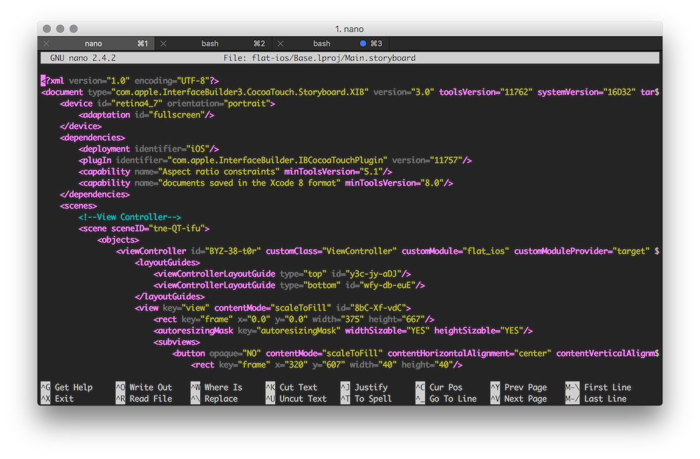

Developing for Mac and iOS isn't my primary profile, but every time I open Xcode IDE, it brings me another bunch of bugs. This time I have got tired because of the bug with Storyboard,where *Connections inspector* missing **Sent Events** section for `UITextField` or `UIButton`.

Every time it happens to me, I'm too lazy to investigate why it happens, but not anymore. I don't want to assign event listeners via `addTarget` or modifying Storyboard in *text editor*, because I like to design as much as possible inside Storyboard editor.

If you have connected `IBAction` before, and after some time the *Sent Events* section become missing, you will get next picture:

This appeared in Xcode 4, and not fixed yet. To fix it, you need to search your project *(or workspace, if you have a lot of subprojects and/or CocoaPods)* for extensions of native `UITextField` class and comment them out.

After it, you can connect all actions you need, safely uncomment that extensions and pray Apple so they could finally find a bug and fix it.

Anyway, if you are too lazy, as me, there is another way to do the same ;)

