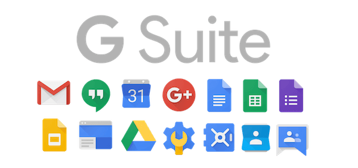
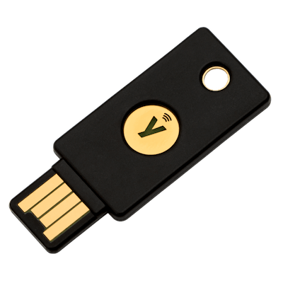

Internet security is something pretty normal nowadays - everybody tries to follow common rules, like configuring 2FA for logins, using password managers and/or hardware keys etc. At least, for me it seems to be common - I’ve been once compromised and I know how that feels, so every device we’re using in my family and every account is being pretty much secured in some way.

I was using one Google account around 10 years ago and was happy enough until I’ve decided that it’s not cool having _@gmail.com_ in the end of your email. So I’ve decided to create free Google Suite plan and connect it to my domain, so I can register custom email address which will be hosted by Google. The ideas behind it (besides it’s cool) are pretty convenient - I will be always using this email, so even in case if I will change email host provider - the email + domain will be actually same, so I will not need to change it in every service I’m using.

Everything was okay until Google started, first of all, deprecating Google Suite Basic plan and making new features only for standard google accounts. So, regarding deprecation - for old users nothing has been changed - accounts are still working normally. But with features I’m having issues, because, for instance, you can’t subscribe to YouTube premium family subscription using Google Suite account. I don’t really know why Google decided to do so. Google Suite is basically a product for companies, and I think there are plenty companies out there which are creating videos, so why the company can’t pay for Youtube premium for entire organisation? It might be called not family subscription, but still such feature should be available, but it isn’t. 

So I’ve decided to restore my old account, and, thankfully, I’m remember password. Yep, on that account I’m having some simple password - 10 years ago I wasn’t so experienced in IT security topics, but was still smart enough to enable 2FA on that account.

Also, about 7 years ago I’ve decided to switch my mobile phone number because I was switching carrier, and back to that days there were no possibilities to transfer your number to different carrier. You probably already know what’s comes next? There are no possibility to recover account without either having access to that phone number or having security codes, which, of course, was lost. I’ve tried to restore access by writing to Google support, but they didn’t believe me, which is fine - anybody could write them impersonating other guy.

The solution was pretty simple - I’ve just checked if my old number was free - and, thankfully, it was - and I’ve ordered it. And my account back with me! Omg, I haven’t use it for 10 years.

The idea of this story that 2FA is great, but what if this phone number was not available anymore, or other guy already bought and use it?

What’s other solutions? You can buy some hardware token, like **Yubikey**, but you can lost it too! But here there are more smart solutions in case of emergencies - you can just have 2 keys, one is your main key and another is backup which you keep at home. And if you would loose your main key - you can login using backup, remove main key and order another backup key - and that’s it. With phone numbers everything much harder - you just can’t ask some other guy to return back his number. 
